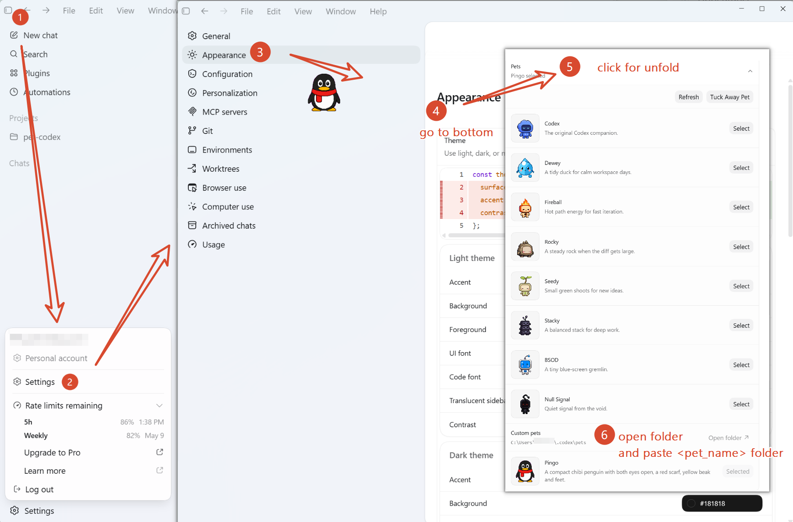

# codex-pet

Not perfert, just enough.

## pets

### codex girl

### pingo

### mimi

A cute cat

## skills

### hatch-pet

`hatch-pet` is original skill made by codex team.

- pixel-style
- must have a character
- use script for transparent background

## Codex

For creating your own pets, install `Hatch Pet` Skill for Plugins, and then input `/hatch` in codex chatbox.

Follow the picture below for change pets.

